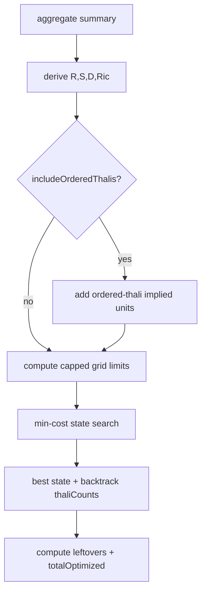

# Order Optimized Amount Algorithm

## Purpose
- Explain how minimum-cost thali bundle selection works for aggregated demand.

## Source files
- `client/src/utils/optimizeExtrasBundles.js`
- `client/src/data/thaliBundles.js`
- `client/src/utils/aggregateHistorySummary.js`

## Last updated
- 2026-04-07

## Copy-paste summary
```text
The optimizer converts summary demand into R/S/D/Ric units, optionally adds ordered-thali implied demand, then searches bundle coverage states (capped 3D grid) using a min-heap relaxation process. Final cost = bundleCost + leftover extras + rice. It returns chosen thali counts, totals, and savings fields used by History/Home/Invoice derivations.
```

## Inputs
- Demand units:
  - `R` roti units
  - `S` sabji portions
  - `D` dal-rice units
  - `Ric` rice units
- Bundle list (`id`, `price`, `roti`, `sabji`, `dalRice`).
- Mode:
  - extras-only
  - full (`includeOrderedThalis=true`)

## Outputs
- `thaliCounts`, `thaliOnlyCost`
- `leftoverRoti`, `leftoverSabji`, `leftoverDal`, `leftoverCost`
- `riceCost`
- `totalOptimized`
- Comparison values: `aLaCarteCost`, `currentPaidCost`, `savings`, `savingsVsCurrent`

## Flow


## Pseudocode
```text
function optimize(summary, includeOrderedThalis):
  extra = extractExtraUnits(summary)
  ordered = includeOrderedThalis ? unitsFromOrderedThalis(summary.thaliCounts) : 0
  R,S,D = extra + ordered
  Ric = summary.riceTotal

  if R,S,D,Ric are all zero: return empty result
  if demand above hard limits: return skipped result

  set caps: R_cap,S_cap,D_cap
  dist[(0,0,0)] = 0
  priorityQueue.push((0,0,0,0))

  while queue not empty:
    cost,cr,cs,cd = popMin()
    for each bundle b:
      nr = min(R_cap, cr + b.roti)
      ns = min(S_cap, cs + b.sabji)
      nd = min(D_cap, cd + b.dalRice)
      relax dist[(nr,ns,nd)] with cost + b.price

  for each state k in dist:
    total = dist[k] + leftoverCost(k,R,S,D) + Ric*30
    keep minimum

  backtrack parents to thaliCounts
  return totals + comparison fields
```

## Complexity and caps
- State size is bounded by `R_cap * S_cap * D_cap`.
- Caps prevent blowups for very large demand.
- Large-demand fallback returns a safe non-optimized output with note.

## Example (conceptual)
- Demand: `R=5, S=1, D=0, Ric=0`
- Candidate: `Thali 5 x1` gives `5 roti + 1 sabji`, cost `₹75`
- A la carte equivalent: `₹90`
- Best: `₹75`, savings `₹15`.
