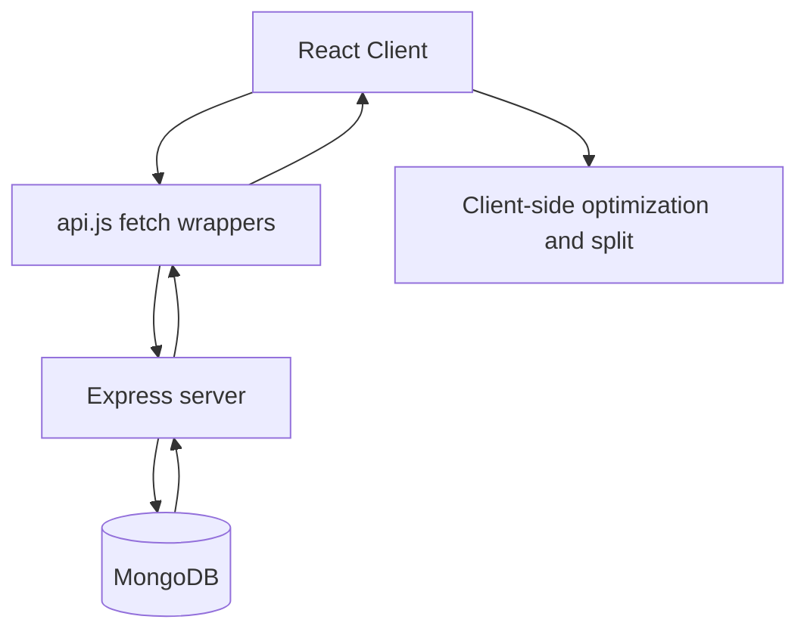

# System Overview

## Purpose
- Explain top-level architecture, runtime boundaries, and data flow between client/server.

## Source files
- `client/src/App.jsx`
- `client/src/api.js`
- `server/src/index.ts`
- `server/src/routes/*`

## Last updated
- 2026-04-07

## Copy-paste summary
```text
React client calls Express APIs. MongoDB stores users, orders, and housekeeper attendance. Client computes optimization/split summaries from fetched order history (no server optimization endpoint). Server is responsible for validation, persistence, and total calculation on order create/update.
```

## Components
- **Client (React + Vite)**: pages, charts, filters, local derivations.
- **Server (Express + Mongoose)**: route handlers, validation, persistence.
- **Database (MongoDB)**: `User`, `Order`, `HousekeeperAttendance`.

## UI routes
- `/` Home
- `/order` Order
- `/history` History
- `/invoice` Invoice
- `/housekeeper` HouseKeeper
- `/users`, `/users/new`

## API routes
- `/api/users`
- `/api/orders`
- `/api/housekeeper`

## Data flow

